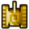
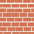
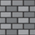
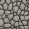

# BATTLE CITY 

## Instrucciones

 
 
Este es **nuestro tanque**, con él debemos sobrevivir a oleadas de enemigos el mayor timpo posible. Por cada tanque enemigo que matemos, ganaremos puntos.
*El juego termina si te pegan una bala o si se juntan más de 5 enemigos.*
* **Movimiento**: Flechas de dirección (left, up, down, right).
* **Disparo**: Espacio. (Una bala = -1 de vida)

### Enemigos
  *Hay 3 clases de enemigos:*
  *  **Comunes**: Tienen 1 de vida y disparan a una velocidad normal. Puntos = 100.
  *  **Veloces**: Tienen 1 de vida y disparan más rapido que los Comunes. Puntos = 300.
  *  **Tanques**: Tienen 3 de vida y disparan igual a los Comunes. Puntos = 500.
 
 
 ### Muros
  *Dificultan o impiden el paso, hay 3 clases:*
  
  *    **Ladrillo**: Se rompen con un disparo. 
  *     **Cemento**: No se rompen con nada. 
  *   **Piedra**: Se rompen con 4 disparos.
  
